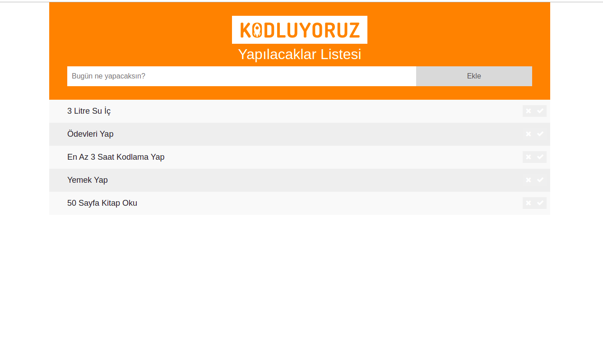
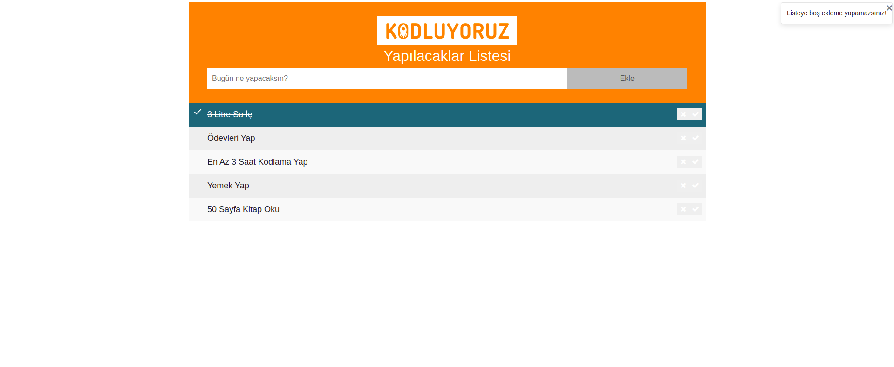

# JavaScript ToDoList

### Kodluyoruz frontend eğitim serisi JavaScript dersi ikinci ödevi olarak ToDoList projesi yazdım.
### Projeye şuradan ulaşabilirsiniz:  https://salik-a.github.io/JavaScriptToDoList/

 Yapacağınız etkinliği input kısmına yazıp ekle butonu ile ekleyebilirsiniz. 

 

 ✓ tuşuna basıp yapıldı şeklinde işaretleyebilir x tuşu ile silebilirsiniz. Boş ekleme yapamazsınız yapmaya çalıştığınızda sağ üstte uyarı alırsınız 

